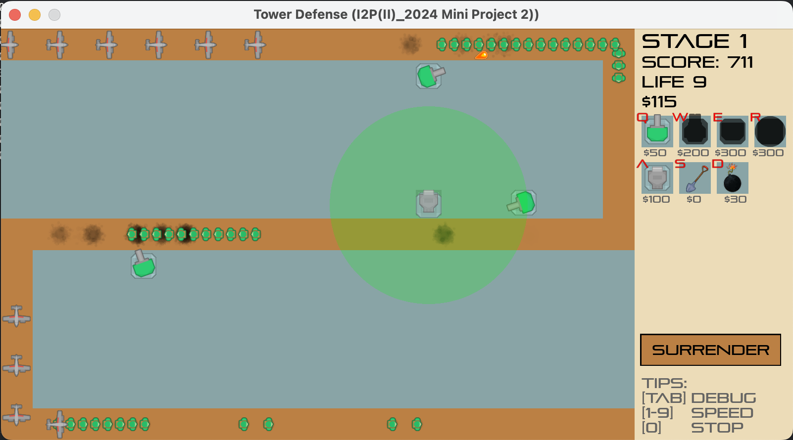
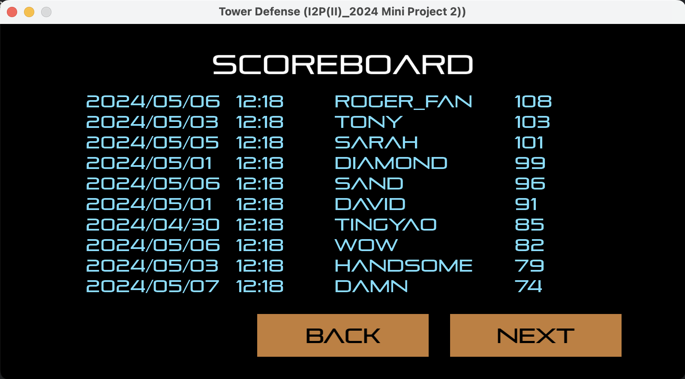

## Project - Freshman 2 - Introduction to Programming 2 - Tower Defense
- A tower defense game developed in C++ using the Allegro Library
- Features:
  - Continuous enemy waves that players must defend against by strategically placing towers. Players lose one life point if enemies reach the bottom-right corner, and the game ends when life points reach zero.
  - Score-based system where eliminating enemies earlier yields higher points (Score distribution can be viewed via the Debug button)
  - Multiple defensive options including:
    - Single-target damage towers
    - Magic towers for area-of-effect damage
    - Shovel tool for tower removal (75% cost refund)
    - Global bomb ability dealing minor damage to all enemies on screen
  - Real-time display of current difficulty level, money, score, remaining lives, and surrender button along with hotkey indicators
  - Quick-access hotkeys for all towers and tools, marked with red letters in the top-left corner of each item
  - Local scoreboard system that persists between game sessions
  - Paginated scoreboard featuring 10 records per page with a maximum capacity of 20 records

### Project Deliverables
- Gameplay Screenshot
  - 
- Scoreboard Screenshot

  - 
- Here are the steps to run the game (in macOS)(see [documentation/](https://github.com/rogerfan48/Project-Fresh1-I2P1-Pacman/blob/main/documentation) if using other OS):
  - Download Necessary Packages
    ```shell
    brew install cmake
    brew install pkg-config
    brew install allegro
    brew install gcc
    brew install ninja
    ```
  - To compile
    ```shell
    sh macos.sh
    ```

### Others
- the **coursework** of I2P2: [Course-Fresh2-I2P2](https://github.com/rogerfan48/Course-Fresh2-I2P2)
- **Final Project** of I2P2: [Project-Fresh2-I2P2-ArenaLegends](https://github.com/rogerfan48/Project-Fresh2-I2P2-ArenaLegends)
